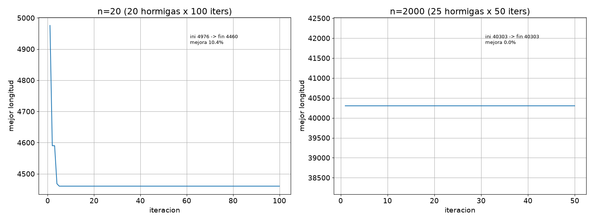
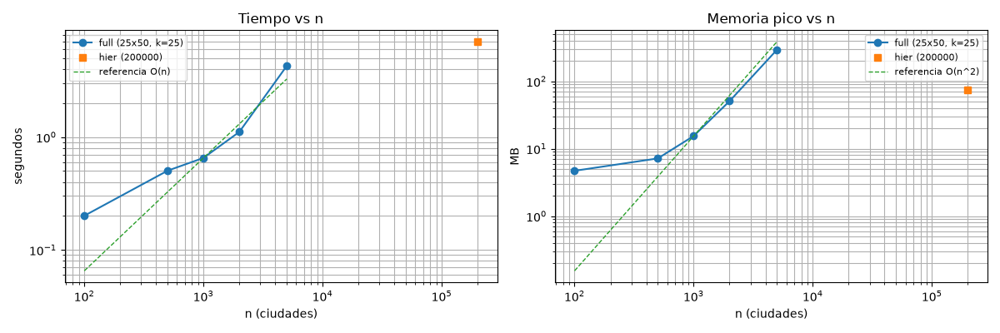
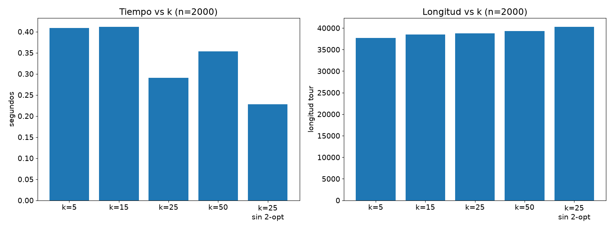

# ACO para el Agente Viajero (TSP)

Optimización por colonia de hormigas para el TSP euclidiano en C++17 con OpenMP. Se mide el desempeño en **tiempo** y **memoria** para 20, 2000 y 200000 ciudades, corriendo todo en local. El informe del taller está en `doc/informe.pdf`.

## Algoritmo

- **MMAS simplificado:** cada hormiga construye un tour con probabilidad proporcional a `tau^alpha * eta^beta` (`tau` feromona, `eta = 1/distancia`). Solo la mejor hormiga global deposita feromona, con límites `[tau_min, tau_max]`.
- **Parámetros:** `alpha = 1.0`, `beta = 2.5`, evaporación `rho = 0.1`. Las hormigas de cada iteración se construyen en paralelo con OpenMP.
- **Lista de candidatos k-NN:** cada paso solo considera las `k` vecinas más cercanas no visitadas. Reduce el costo por paso de `O(n)` a `O(k)`. Sin matriz `n×n`: distancias al vuelo + feromona dispersa `n×k`.
- **2-opt:** mejora local *first-improvement* al mejor tour de cada iteración y al final (ventana de 40 vecinos si `n > 500`).
- **Modos:** `full` (ACO disperso `O(n·k)`, `n <= 5000`), `hier` (jerárquico para `n` grande: rejilla → ACO por celda de ~600 puntos → unión por centroides), `nn` (vecino más cercano, referencia). `auto` elige solo.

## Método experimental

1. Con semilla `42`, se generan instancias euclidianas de **20, 2000 y 200000** puntos uniformes en `[0,1000]^2`. La misma semilla produce los mismos puntos en cualquier máquina.
2. Se corre ACO completo en 20 (`20 hormigas × 100 iters`, `k = 8`) y en 2000 (`25 × 50`, `k = 25`), y ACO jerárquico en 200000 (361 celdas, `~10 × 25` por celda).
3. Se registran tres métricas: **longitud del tour**, **tiempo** (`chrono::steady_clock`, ms) y **memoria pico** (`getrusage`, KB).

Para reproducir el experimento:

```bash
cmake -S . -B build -DCMAKE_BUILD_TYPE=Release
cmake --build build -j$(nproc)
bash scripts/run_benchmark.sh
python3 scripts/plot.py results.csv
# Experimentos extra: escalamiento, sensibilidad a k, convergencia
bash scripts/run_extra.sh
python3 scripts/plot_extra.py
```

Sin cmake, con un solo comando:

```bash
g++ -O3 -std=c++17 -fopenmp src/main.cpp -o aco
./aco --n 20 --ants 20 --iters 100 --cand 8 --seed 42 --mode full
```

Otros comandos útiles:

```bash
./aco --n 2000 --ants 25 --iters 50 --cand 25 --seed 42 --mode full --out results.csv
./aco --n 200000 --seed 42 --mode hier --target-cluster 600 --out results.csv
./aco --help
```

## Resultados

| n | Modo | Longitud | Tiempo | Memoria pico |
|---|--:|---:|---:|---:|
| 20 | full (k=8) | 4460.31 | 0.05 s | 4.6 MB |
| 2000 | full (k=25) | 38762.69 | 0.38 s | 5.7 MB |
| 200000 | hier (361 celdas) | 412373.13 | 2.69 s | 11.7 MB |

Las longitudes corresponden a la muestra reproducible con la semilla indicada. Los tiempos y memorias son de una ejecución de ejemplo (Arch Linux, 12 núcleos, 14 GB RAM, `g++ 16.2.1`) y cambian según el equipo. Tras el híbrido disperso (`n×k`, sin matriz densa) la memoria baja ~9× en `n=2000` y ~6× en `n=200k`, y el tiempo ~3× (eta precalculada, sin `pow()` por paso, fallback sin alloc).


De 20 a 2000 ciudades (×100 en `n`) el tiempo solo sube ×8 gracias a los candidatos, y la memoria (5.7 MB) refleja el `O(n·k)` disperso: `idx+dist+tau+eta` (~0.76 MB teóricos en `n=2000,k=25` + puntos y overhead de hilos). El caso de 200000 se resuelve en ~2.7 s y ~11.7 MB porque nunca se construye la matriz global (pediría ~152 GB por matriz densa); cada celda aloja estructuras de ~600×15. Las longitudes no son comparables entre tamaños porque cada `n` usa una instancia distinta; para comparar variantes hay que fijar el mismo `n` y `--seed`.



La curva de `n = 20` baja 10.4 % y se estabiliza hacia la iteración 30 (las 70 restantes sobran). La de `n = 2000` es plana: la colonia no supera al greedy y el salto final lo da el 2-opt, lo que indica invertir en hormigas/2-opt y no en más iteraciones.



Con `k` fijo el tiempo sigue la recta `O(n)` y la memoria la `O(n·k)`; el punto `hier` (200000) queda muy por debajo de ambas, prueba empírica de que el particionado + dispersión rompen el `O(n²)`.



La longitud no cambia con `k = 5..50` (el 2-opt corrige todo), pero sin 2-opt empeora 4 %. En `n = 200`, `k = 0` tarda el doble (139.8 ms vs 68.2 ms) que `k = 10`: la lista acelera sin degradar.

## Complejidad computacional

Si `t` son las iteraciones, `m` las hormigas, `n` las ciudades y `k` los candidatos, el trabajo de construcción de tours es:

```text
full (disperso): O(t·m·n·k)
  sale de: n pasos × hasta k candidatas por paso = O(n·k) por hormiga,
  × m hormigas = O(m·n·k) por iteración, × t iteraciones.
  Sin candidatos (k = n) sería O(t·m·n²).
hier:         O(n) global + ACO por celda de tamaño acotado
  sale de: C ≈ n/c celdas × costo de celda O(tc·mc·c·k) → lineal en n;
  ordenar C centroides cuesta O(C²), despreciable (C = 361).
```

En modo `full` la memoria es `O(n·k)`: `idx(int)+dist(float)+tau(float)+eta(float)`
(`4·n·k·4` bytes: 0.76 MB teóricos en `n = 2000,k = 25`, 5.7 MB medidos con hilos y
auxiliares; densa teórica `n²·4` sería 15.3 MB en `n = 2000`, 152 GB en `n = 200000`).
En modo `hier` la memoria global es `O(n)` (el vector de puntos en `float`) más una
celda `O(c·k)` por hilo. El 2-opt por iteración está acotado por la ventana de vecinos cuando `n > 500`.
