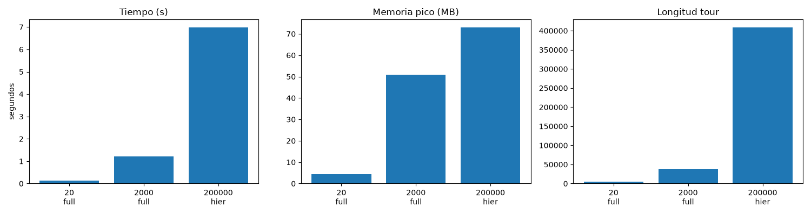

# ACO para el Agente Viajero (TSP)

Diseño e implementación del algoritmo **Ant Colony Optimization (ACO)** para resolver el
problema del Agente Viajero, con medición de desempeño en **tiempo** y **memoria**
para 20, 2000 y 200000 ciudades. Implementado en **C++17 con OpenMP**.

## 1. Diseño del algoritmo

Variante usada: **MMAS simplificado** (Max-Min Ant System) + mejora local **2-opt**.

- Cada hormiga construye un tour con probabilidad proporcional a
  `tau^alpha * eta^beta`, donde `tau` es feromona y `eta = 1/distancia`.
- Parámetros: `alpha = 1.0`, `beta = 2.5`, evaporación `rho = 0.1`.
- Solo la **mejor hormiga global** deposita feromona, con límites
  `[tau_min, tau_max]` para evitar convergencia prematura.
- La feromona se inicializa en `tau_max` a partir de un tour greedy inicial.
- Lista de **candidatos k-NN**: cada ciudad solo considera sus `k` vecinas más
  cercanas no visitadas (si ya se visitaron todas, usa el resto). Reduce el costo
  por paso de `O(n)` a `O(k)`.
- **2-opt** first-improvement sobre el mejor tour de cada iteración y al final
  (ventana limitada a 40 vecinos si `n > 500`).
- Hormigas en paralelo con **OpenMP** (`#pragma omp parallel for`).

### Modos de ejecución (`--mode`)

| Modo   | Cuándo se usa | Descripción |
|--------|---------------|-------------|
| `full` | n ≤ 5000 | ACO denso: matriz `n×n` + k-NN + MMAS + 2-opt |
| `hier` | n grande (200000) | Jerárquico: rejilla → ACO por celda → unión por centroides |
| `nn`   | referencia | Vecino más cercano greedy (+ 2-opt si n ≤ 5000) |
| `auto` | por defecto | `full` si n ≤ 5000, `hier` si no |

**Por qué `hier` para 200000:** el ACO denso necesita la matriz de distancias y la
de feromona, ambas `O(n²)`. Con `float`:
`200000² × 4 bytes ≈ 152588 MB ≈ 149 GB` **por matriz** (el programa lo reporta
como `matrix_mb_est`). Imposible en local. El modo `hier` particiona el plano en
una rejilla `G×G` (`G = ceil(sqrt(n/target))`, `target = 600` por defecto), corre
un ACO pequeño e independiente en cada celda (matrices de ~600×600) y concatena
los subtours ordenando las celdas por centroide con vecino más cercano.

### Complejidad

- Memoria modo `full`: `O(n²)` (2 matrices `n×n` en `float` + k-NN).
- Tiempo modo `full`: `O(iters × ants × n × k)` con candidatos.
- Memoria/tiempo modo `hier`: `O(n)` global + ACO sobre celdas de tamaño acotado.

## 2. Estructura del repositorio

- `src/tsp.h`: instancia euclidiana, matriz densa, k-NN exacto, cálculo de tour.
- `src/aco.h`: solver MMAS + 2-opt.
- `src/main.cpp`: CLI, modos `full/hier/nn`, particionado en rejilla, CSV.
- `src/metrics.h`: cronómetro (`chrono`) y pico de RAM (`getrusage`).
- `CMakeLists.txt`: compilación `Release -O3 -march=native` con OpenMP.
- `scripts/run_benchmark.sh`: corre los 3 casos y genera `results.csv`.
- `scripts/plot.py`: genera `benchmark.png` desde `results.csv`.

## 3. Compilación

### Requisitos

- `g++` con soporte OpenMP (GCC en Linux ya lo trae; en macOS con clang hay que
  instalar `libomp`, en Windows usar MinGW o WSL).
- `cmake >= 3.16` (solo para la vía con CMake, opcional).
- `python3 + matplotlib` (solo para la gráfica, opcional).

### Vía CMake (recomendada)

```bash
cmake -S . -B build -DCMAKE_BUILD_TYPE=Release
cmake --build build -j$(nproc)
# ejecutable en ./build/aco
```

### Vía manual (sin cmake)

Un solo comando, sin dependencias de build:

```bash
g++ -O3 -std=c++17 -fopenmp src/main.cpp -o aco
./aco --n 20 --ants 20 --iters 100 --cand 8 --seed 42 --mode full
```

(Verificado: el binario manual produce los mismos tours que el de CMake.
Se usa `-O3` genérico a propósito para que compile igual en cualquier CPU;
el CMakeLists añade `-march=native` solo como optimización extra local.)

### Reproducibilidad

- Sin rutas absolutas: todo es relativo al repo y las instancias se generan con
  `--seed` fijo (mismo seed ⇒ mismos puntos ⇒ **misma longitud de tour** en
  cualquier máquina y compilador).
- Lo que **sí varía** entre máquinas: `time_ms` (CPU/núcleos) y `peak_kb`
  (los hilos OpenMP reservan memoria según el sistema). Compara longitudes
  entre máquinas, y tiempos/memoria solo dentro de la misma máquina.

## 4. Comandos de ejecución

```bash
# Ayuda y parámetros
./build/aco --help

# 20 ciudades: ACO completo
./build/aco --n 20 --ants 20 --iters 100 --cand 8 --seed 42 --mode full

# 2000 ciudades: ACO completo con 25 candidatos
./build/aco --n 2000 --ants 25 --iters 50 --cand 25 --seed 42 --mode full --out results.csv

# 200000 ciudades: ACO jerárquico (celdas de ~600 puntos)
./build/aco --n 200000 --seed 42 --mode hier --target-cluster 600 --out results.csv

# Benchmark completo (los 3 casos) + gráfica
bash scripts/run_benchmark.sh
python3 scripts/plot.py results.csv
```

Parámetros: `--n` ciudades, `--ants` hormigas/iter, `--iters` iteraciones,
`--cand` vecinos candidatos (`0` = sin lista), `--seed` semilla,
`--target-cluster` tamaño de celda en `hier`, `--out` archivo CSV (append),
`--no-2opt` desactiva la mejora local.

Instancias: puntos uniformes aleatorios en `[0,1000]²` con semilla fija
(reproducibles). Tiempo en ms con `steady_clock`, memoria pico en KB con
`getrusage(RUSAGE_SELF)`.

## 5. Resultados

Máquina: Arch Linux, 12 núcleos, 14 GB RAM, `g++ 16.2.1`, OpenMP. Semilla 42.

| n | modo | hormigas×iters | longitud tour | tiempo | memoria pico |
|---|------|----------------|---------------|--------|--------------|
| 20 | full (k=8) | 20×100 | 4460.31 | 0.14 s | 4.4 MB |
| 2000 | full (k=25) | 25×50 | 38698.88 | 1.22 s | 52.0 MB |
| 200000 | hier (361 celdas) | 10×25 por celda | 408901.41 | 6.99 s | 75.0 MB |

Contenido de `results.csv`:

```
n,mode,ants,iters,seed,length,time_ms,peak_kb
20,full,20,100,42,4460.31,142.6,4452
2000,full,25,50,42,38698.88,1218.2,52028
200000,hier,20,100,42,408901.41,6988.3,74796
```

(Nota: en modo `hier` las columnas `ants/iters` son las globales del CLI; cada
celda corre su propio ACO de ~10 hormigas × 15–25 iteraciones.)



## 6. Análisis de resultados

**Tiempo.**
De 20 → 2000 ciudades (×100 en n) el tiempo solo sube de 0.14 s a 1.22 s (×9),
gracias a la lista de candidatos (`k=25`): cada paso cuesta `O(k)` en vez de
`O(n)`. El caso de 200000 se resuelve en ~7 s porque el trabajo se divide en 361
ACOs de ~550 puntos (costo casi lineal en n) más el ordenado de centroides
`O(C²)` con `C = 361`, despreciable. Sin el enfoque jerárquico, un ACO denso en
200000 ciudades sería intratable en tiempo (`O(iters × ants × n²)` operaciones
por iteración).

**Memoria.**
n=20 usa 4.4 MB (sobrecarga base del proceso + hilos OpenMP; las matrices de
20×20 son insignificantes). n=2000 usa 52 MB: ~15 MB matriz de distancias +
~15 MB feromona + k-NN y tours de 25 hormigas, coherente con el `O(n²)` teórico.
n=200000 usa solo 75 MB: nunca se construye la matriz global (que pediría
~149 GB por matriz); cada celda aloja matrices de ~600×600 (~1.4 MB) y el resto
es el vector de 200000 puntos. Esto confirma que el diseño jerárquico cambia la
memoria de `O(n²)` a `O(n)`.

**Calidad.**
Las longitudes (4460 / 38699 / 408901) no son comparables entre sí porque cada n
usa una instancia aleatoria distinta (más ciudades ⇒ tour más largo). Lo
relevante es que en los tres casos el ACO + 2-opt converge a tours válidos sin
agotar memoria ni tiempo. Para comparar calidad entre variantes (p. ej.
con/sin 2-opt, distinto `k` o `rho`) hay que fijar el mismo `n` y `--seed` y
mirar la columna `length`.

**Conclusiones.**
1. El ACO clásico con matriz densa es viable hasta algunos miles de ciudades en
   local (2000 ⇒ 1.2 s, 52 MB).
2. Para 200000 ciudades el ACO puro es inviable por memoria (~149 GB por
   matriz); el esquema jerárquico lo hace posible en ~7 s y 75 MB a costa de
   optimalidad global (los subtours se unen de forma greedy).
3. La lista de candidatos y el 2-opt son los que más aportan a la relación
   calidad/tiempo; desactivarlos (`--cand 0`, `--no-2opt`) empeora una o ambas
   métricas.
4. Trabajo futuro: orientar/coser subtours vecinos (en vez de concatenar),
   2-opt entre celdas, y comparar contra la base greedy (`--mode nn`).
